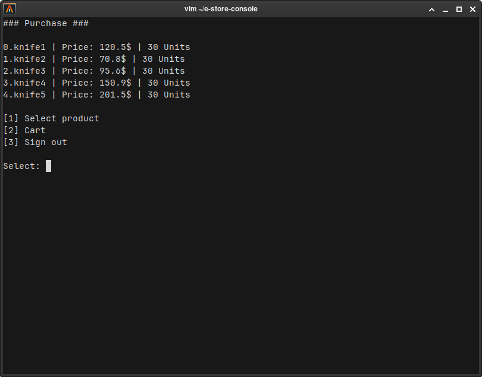

# E-Store Console Application

## English

This is a console-based e-store project written in C++.
Features:
- Admin panel for adding and editing products
- Buyer interface to browse products, manage cart, and place orders
- Basic user registration and login system
- Centralized data management via a Database class
- Modular structure using OOP

### Screenshot

---

## Русский

Консольный проект интернет-магазина на C++.
Возможности:
- Админ-панель для добавления и редактирования товаров
- Интерфейс покупателя: просмотр товаров, корзина, оформление заказов
- Простая регистрация и авторизация
- Централизованное управление данными через класс `Database`
- Модульная структура с использованием ООП
